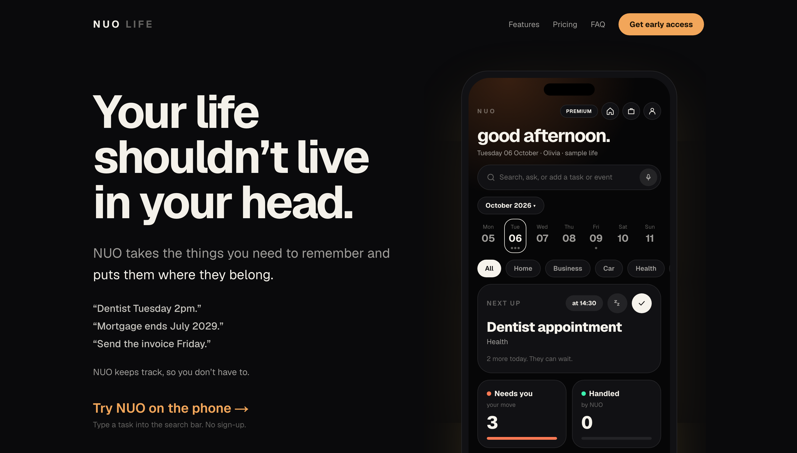
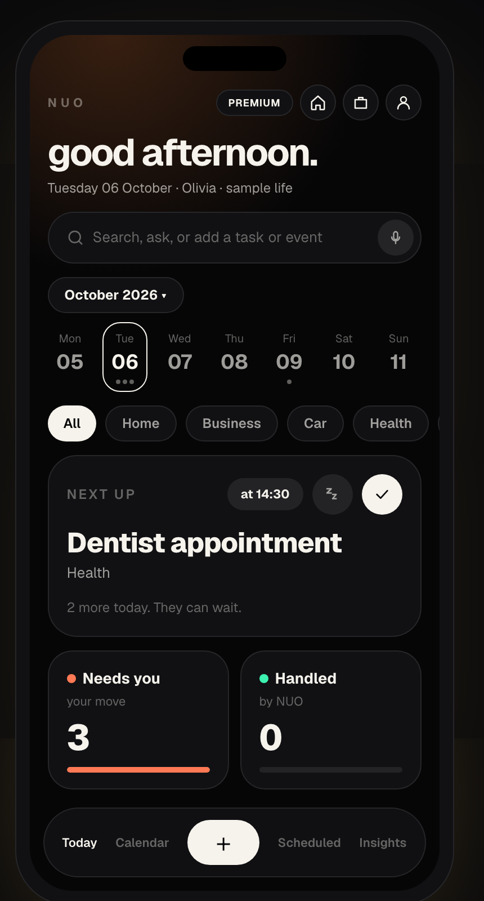
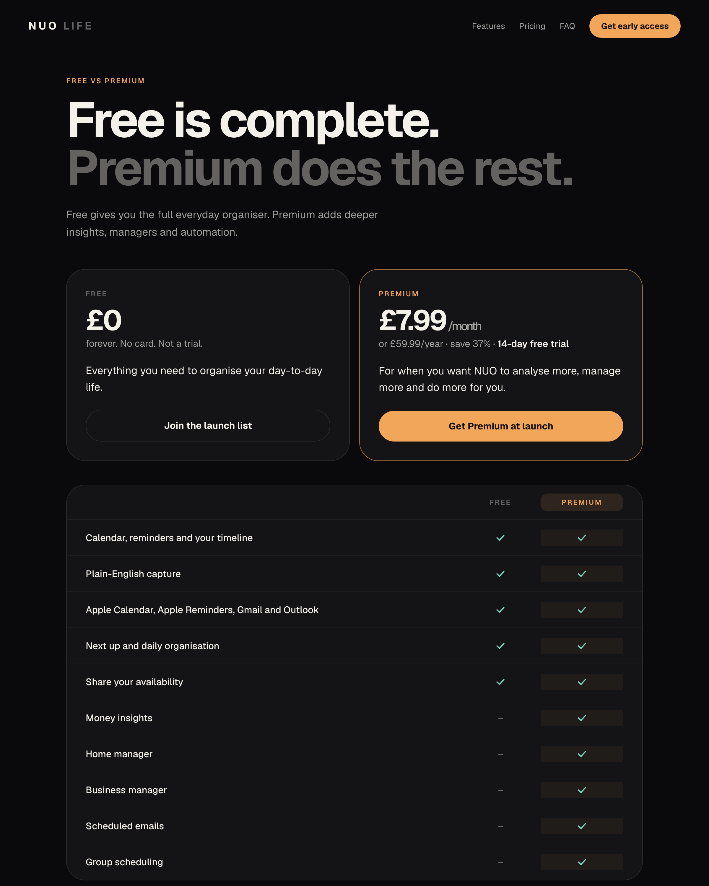
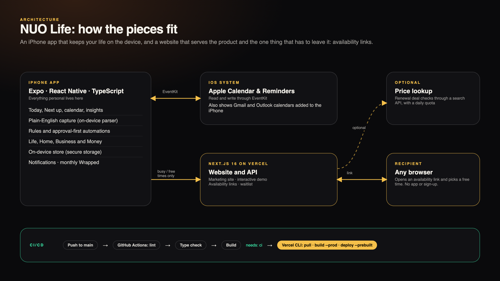
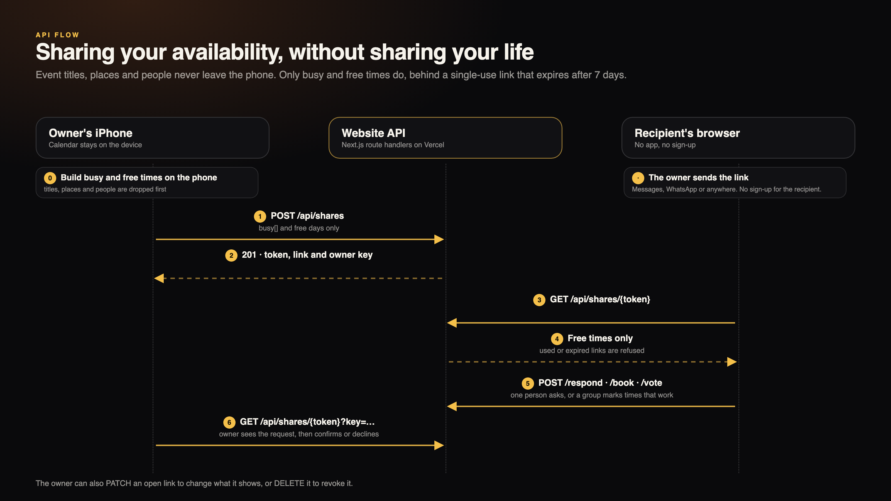
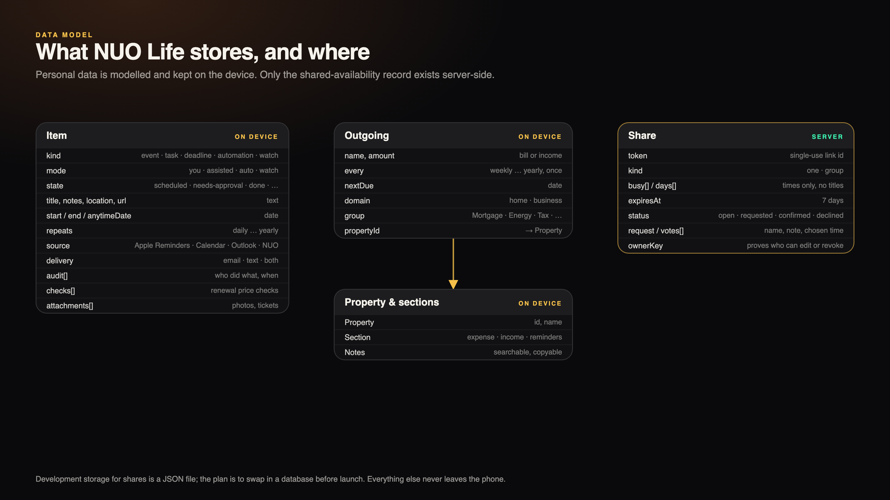

# NUO Life

**Your life shouldn't live in your head.**
A calm life-admin app for UK adults, designed with ADHD in mind. Type something the way you'd say it, and NUO puts it where it belongs: on one timeline with your calendar, reminders, bills and renewals.

> Commercial product built under NUO Tech. **Production source code is private.** This repository is a showcase of the product, the design and the engineering behind it.

### [View the live product →](https://nuo-life.vercel.app)

## What it is

- **An iPhone app** (Expo / React Native) that keeps everything personal on the device.
- **A website** (Next.js) that shows the product, lets you play with it, and powers the one feature that has to leave the phone: shareable availability links.
- **A product, not a prototype**: Free and Premium plans, a waitlist, a continuous-deployment pipeline and one consistent visual language across both.

  
  &nbsp;&nbsp;&nbsp;
  

## Stack

| Layer | Technology |
| --- | --- |
| iPhone app | Expo SDK 57, React Native 0.86, React 19, TypeScript |
| Device integrations | EventKit (via `expo-calendar`), local notifications, secure storage, haptics, image rendering for shareable recaps |
| Website and API | Next.js 16 (App Router), React 19, TypeScript, Tailwind CSS 4, route handlers |
| Hosting and delivery | Vercel, GitHub Actions |
| Data | On-device store for personal data. Server side: shared availability records only (development storage is a JSON file; a database is planned before launch) |
| Quality gates | ESLint 9, `tsc --noEmit`, production build on every pull request |

## Engineering highlights

- **Natural-language capture.** A hand-written, on-device parser turns sentences into structured items: dates and ranges, repeats, amounts, categories and several entries from one sentence. It never invents a time you didn't give, and everything stays editable.
- **Calendar and reminder integrations.** Reads and writes Apple Calendar and Reminders through EventKit, including Gmail and Outlook calendars added to the iPhone, and keeps ticks in step in both directions.
- **Approval-first automations.** Items carry a mode (you, assisted, auto, watch) and a state machine (scheduled, needs approval, done, failed, cancelled) with an audit trail. Nothing goes out without approval, and it only shows as sent once it has been.
- **Multi-domain architecture.** Life, Home and Business are separate spaces over one timeline, with Money insights computed from figures the user enters (never a bank connection) and recalculated as a saved monthly calculation, with the working shown.
- **Privacy by design.** Availability links upload only busy and free times, never titles, places or people. Links are single-use, expire after seven days, and are protected by an owner key for edits and revocation. Group links let several people mark the times that work.
- **ADHD-aware product design.** One-thing-at-a-time "Next up", "still open" instead of "overdue", undo for everything, brain-dump capture, and reduced-motion support on the website.
- **A website that mirrors the app.** The hero is a playable Today screen on in-memory sample data: add a task by typing in the search bar or with the + button, tick, snooze, switch days. Nothing typed is saved or sent, and it clears when you leave.
- **CI/CD.** Pull requests run lint, type check and build. A push to `main` deploys to Vercel only if every check passes (`needs: ci`), using the Vercel CLI (`pull`, `build --prod`, `deploy --prebuilt`) with credentials in GitHub secrets. Vercel's own Git deploys are off, so the pipeline is the only route to production.

## Architecture

## API flow: sharing availability without sharing your life

## Data model

## Status and roadmap

The website is live and the waitlist is open. The iPhone app is in pre-launch development. Still to come: server-side persistence for shared links, real email and text delivery, billing, and direct Google and Microsoft calendar connections.

---

© 2026 NUO LIFE · Powered by NUO Tech
